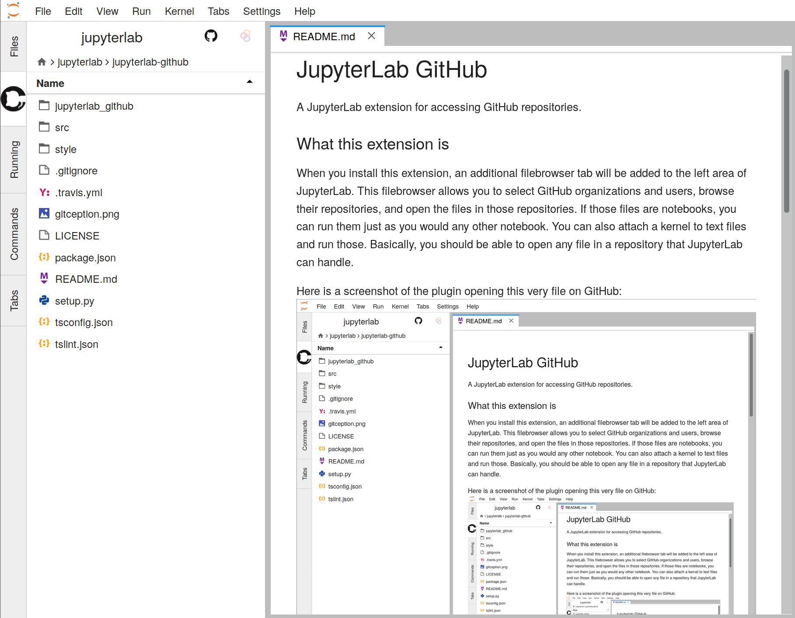

# JupyterLab GitHub

A JupyterLab extension for accessing GitHub repositories.

### What this extension is

When you install this extension, an additional filebrowser tab will be added
to the left area of JupyterLab. This filebrowser allows you to select GitHub
organizations and users, browse their repositories, and open the files in those
repositories. If those files are notebooks, you can run them just as you would
any other notebook. You can also attach a kernel to text files and run those.
Basically, you should be able to open any file in a repository that JupyterLab can handle.

Here is a screenshot of the plugin opening this very file on GitHub:


### What this extension is not

This is not an extension that provides full GitHub access, such as
saving files, making commits, forking repositories, etc.
For it to be so, it would need to more-or-less reinvent the GitHub website,
which represents a huge increase in complexity for the extension.

### A note on rate-limiting

This extension has both a client-side component (that is, Javascript that is bundled
with JupyterLab), and a server-side component (that is, Python code that is added
to the Jupyter notebook server). This extension *will* work with out the server extension,
with a major caveat: when making unauthenticated requests to GitHub 
(as we must do to get repository data), GitHub imposes fairly strict rate-limits
on how many requests we can make. As such, you are likely to hit that limit
within a few minutes of work. You will then have to wait up to an hour to regain access.

For that reason, we recommend that you take the time and effort to set up the server
extension as well as the lab extension, which will allow you to access higher rate-limits.
This process is described in the [installation](#Installation) section.

## Prerequisites

* JupyterLab 0.31
* A GitHub account for the serverextension

## Installation

As discussed above, this extension has both a serverextension and a labextension.
We recommend installing both so as to not be rate-limited.
The purpose of the serverextension is to add GitHub credentials that you will need to acquire
from https://github.com/settings/developers, and then to proxy your request to GitHub.

### 1. Installing the labextension

To install the labextension, enter the following in your terminal:
```bash
jupyter labextension install @jupyterlab/github
```
With only this installed, the extension should work, and you can experience the joys of
being rate-limited first-hand!

### 2. Getting your credentials from GitHub

You will need to register an OAuth application with GitHub by following these steps:
1. Log into your GitHub account.
1. Go to https://github.com/settings/developers and select the "OAuth Apps" tab on the left.
1. Click the "New OAuth App" button.
1. Fill out a name, homepage URL, description, and callback URL in the form.
This extension does not actually use OAuth, so these values actually *do not matter much*,
you just need to enter them to register the application.
1. Click the "Register application" button.
1. You should be taken to a new page with the new application information.
If you see fields showing "Client ID" and "Client Secret", congratulations!
These are the strings we need, and you have successfuly set up the application.

It is important to note that the "Client Secret" string is, as the name suggests, a secret.
*Do not* share this value online, as people may be able to use it to impersonate you on GitHub.

### 3. Installing the serverextension

Install the serverextension using pip, and then enable it:
```bash
pip install jupyterlab_github
```

If you are running Notebook 5.2 or earlier, enable the server extension by running
```bash
jupyter serverextension enable --sys-prefix jupyterlab_github
```

You then need to add our "Client ID" and "Client Secret" credentials from above
to your notebook configuration file. Instructions for generating a configuration
file can be found [here](http://jupyter-notebook.readthedocs.io/en/stable/config_overview.html#configure-nbserver)
Once you have identified this file, add the following lines to it:
```python
c.GitHubConfig.client_id = '< YOUR_CLIENT_ID >'
c.GitHubConfig.client_secret = '< YOUR_CLIENT_SECRET >'
```
where "`< YOUR_CLIENT_ID >`" and "`< YOUR_CLIENT_SECRET >`" are the string values you obtained above.

With this, you should be done! Launch JupyterLab and look for the GitHub tab on the left!
